# HW 3
#### Yihang Chen

## Part 1 Crime Scene Investigation with Blind Image Deconvolution
### 1.1
#### 1.1.a
Since ${\rm proj}_{\mathcal{X}}(\mathbf{Z}) = \arg\min_{\mathbf{X}\in\mathcal{X}}\{\|\mathbf{X}-\mathbf{Z}\|_F^2\}$, ${\rm prox}_{\delta_\mathcal{X}}(\mathbf{Z}) = \arg\min_{{\mathbf{X}}\in\mathbb{R}^{p \times m}}\{\delta_\mathcal{X}({\mathbf{X}})+\frac{1}{2}\|{\mathbf{X}}-\mathbf{Z}\|_F^2\}$, and $\delta_\mathcal{X}({\mathbf{X}}) = 0$ when ${\mathbf{X}}\in\mathcal{X}$, and $\delta_\mathcal{X}({\mathbf{X}}) = +\infty$ when ${\mathbf{X}}\notin\mathcal{X}$. Hence, $\arg\min_{{\mathbf{X}}\in\mathbb{R}^{p \times m}}\{\delta_\mathbf{X}({\mathbf{X}})+\frac{1}{2}\|{\mathbf{X}}-\mathbf{Z}\|_F^2\} \subset \mathcal{X}$, i.e. $\arg\min_{{\mathbf{X}}\in\mathbb{R}^{p \times m}}\{\delta_\mathbf{X}({\mathbf{X}})+\frac{1}{2}\|{\mathbf{X}}-\mathbf{Z}\|_F^2\} = \arg\min_{{\mathbf{X}}\in\mathcal{X}}\{\frac{1}{2}\|{\mathbf{X}}-\mathbf{Z}\|_F^2\} = {\rm proj}_{\mathcal{X}}(\mathbf{Z})$.

In all, ${\rm proj}_{\mathcal{X}}(\mathbf{Z}) = {\rm prox}_{\delta_\mathcal{X}}(\mathbf{Z})$.

#### 1.1.b
**Equivalent characterization of the Euclidean projection**:
$z^\star={\rm proj}_\mathcal{X}(x)\iff\langle x-z^\star,z-z^\star\rangle\leq 0, \forall z\in \mathcal{X}$.

Proof of Equivalent characterization of the Euclidean projection. 

$\Longleftarrow$ Define $f(x) = \|x-z\|^2$, then $f$ is convex and differentiable over an open set that contains $\mathcal{X}$. Since the equation holds, and $\nabla f(x) = z-x$. Hence, $\langle\nabla f(z^\star), z-z^\star\rangle\geq 0$. Since $f$ is convex, we have $f(z)\geq f(z^\star)+\langle\nabla f(z^\star), z-z^\star\rangle\geq f(z^\star), \forall z\in\mathcal{X}$.

$\Longrightarrow$ Assume the contrary, i.e., $z^\star$ minimizes $f$ over $\mathcal{X}$ and $\langle\nabla f(z^\star), z-z^\star\rangle < 0$ for some
$z\in\mathcal{X}$. By differentiation, we have
$$
\lim_{\alpha\to 0+}\frac{f(z^\star+\alpha(z-z^\star))-f(x^\star)}{\alpha} = \langle\nabla f(z^\star), z-z^\star\rangle < 0
$$
Since $\mathcal{X}$ is convex, $z,z^\star\in\mathcal{X}$, and hence $z^\star+\alpha(z-z^\star)\in \mathcal{X}$. So $f(z^\star+\alpha(z-z^\star))<f(z^\star)$ strictly for small $\alpha > 0$, contradicting the optimality.

**Main proof**

By the Equivalent characterization of the Euclidean projection, we have
$\langle x-{\rm proj}_\mathcal{X}(x), z-{\rm proj}_\mathcal{X}(x)\rangle\leq 0, \forall x\in \mathcal{X}$. Taking $z={\rm proj}_\mathcal{X}(y)$, we have
$$
\langle x-{\rm proj}_\mathcal{X}(x), {\rm proj}_\mathcal{X}(y)-{\rm proj}_\mathcal{X}(x)\rangle\leq 0
$$
similarly
$$
\langle y-{\rm proj}_\mathcal{X}(y), {\rm proj}_\mathcal{X}(x)-{\rm proj}_\mathcal{X}(y)\rangle\leq 0
$$
i.e.
$$
\langle {\rm proj}_\mathcal{X}(y)-y, {\rm proj}_\mathcal{X}(y)-{\rm proj}_\mathcal{X}(x)\rangle\leq 0
$$
Adding these two inequalities, rearranging and finally applying the Cauchy-Schwarz inequality, we get:
$$
\langle {\rm proj}_\mathcal{X}(y)-{\rm proj}_\mathcal{X}(x), {\rm proj}_\mathcal{X}(y)-{\rm proj}_\mathcal{X}(x)\rangle\\\leq \langle y-x, {\rm proj}_\mathcal{X}(y)-{\rm proj}_\mathcal{X}(x)\rangle\leq \|y-x\|\|{\rm proj}_\mathcal{X}(y)-{\rm proj}_\mathcal{X}(x)\|
$$
i.e.
$$
\|{\rm proj}_\mathcal{X}(y)-{\rm proj}_\mathcal{X}(x)\|\leq \|y-x\|
$$
where where $\|\cdot\|$ denotes the usual Euclidean norm.

**Non-convex counterexample**
Define $\mathcal{X} = {x:1\leq\|x\|_2\leq 2, x\in\mathbb{R}^2}$. Consider $x_1=(\frac{1}{2},0), x_2=(-\frac{1}{2},0)$. We have ${\rm proj}_\mathcal{X}(x_1)=(1,0), {\rm proj}_\mathcal{X}(x_2)=(-1,0)$. Hence, $\|{\rm proj}_\mathcal{X}(x_1)-{\rm proj}_\mathcal{X}(x_2)\|> \|x_1-x_2\|$. Hence, for non-convex $\mathcal{X}$ the contraction does not hold.

#### 1.1.c
By SVD decomposition, we have $\mathbf{X}=\mathbf{U_X\Sigma_X V_X^\top}, \mathbf{Z}=\mathbf{U_Z\Sigma_Z V_Z^\top}$. Denote the solution to the projection to be $\mathbf{X}^\star$.

According to Mirsky’s inequality, For any $\mathbf{X}\in\mathcal{X}$,
$$
\|\mathbf{X}-\mathbf{Z}\|_F\geq \|\mathbf{\Sigma_X}-\mathbf{\Sigma_Z}\|_F
$$
We try to find $\mathbf{X}\in\mathcal{X}$ minimizes $\|\mathbf{\Sigma_X}-\mathbf{\Sigma_Z}\|_F$.

Since for any $\mathbf{X}\in\mathcal{X}$, the sum of diagonal matrix $\mathbf{\Sigma_X}$ is no larger than $\kappa$. Define $\sigma_\mathbf{X}, \sigma_\mathbf{Z}$ to be the diagonal term of $\mathbf{\Sigma_X}, \mathbf{\Sigma_Z}$. We have 
$$
\|\mathbf{\Sigma_X}-\mathbf{\Sigma_Z}\|_F = \|\sigma_\mathbf{X}-\sigma_\mathbf{Z}\|_2, \|\sigma_\mathbf{X}\|_1\leq \kappa,
$$
Since by the definition $\sigma_\mathbf{Z}^{\ell_1} = \arg\min_{\|\sigma\|_1\leq \kappa}\|\sigma-\sigma_\mathbf{Z}\|_2$, the optimal $\sigma_{\mathbf{X}^\star}=\sigma_\mathbf{Z}^{\ell_1}$, and $\mathbf{\Sigma_{X^\star}}=\mathrm{diag}(\sigma_\mathbf{Z}^{\ell_1})=\mathbf{\Sigma_Z}^{\ell_1}$. In other words, $\mathbf{X}^\star=\mathbf{U_{X^\star}}\mathbf{\Sigma_Z}^{\ell_1}\mathbf{V_{X^\star}^\top}$, and
$$
\|\mathbf{X}-\mathbf{Z}\|_F\geq \|\mathbf{\Sigma_X}-\mathbf{\Sigma_Z}\|_F\geq \|\mathbf{\Sigma_Z}^{\ell_1}-\mathbf{\Sigma_Z}\|_F, \forall \mathbf{X}\in\mathcal{X}
$$
If setting $\mathbf{U_{X^\star}}=\mathbf{U_Z}$, $\mathbf{V_{X^\star}}=\mathbf{V_Z}$, 
$$
\|\mathbf{\Sigma_X}-\mathbf{\Sigma_Z}\|_F = \|\mathbf{U_Z}\mathbf{\Sigma_Z}^{\ell_1}\mathbf{V_Z}^\top-\mathbf{U_Z}\mathbf{\Sigma_Z}\mathbf{V_Z}^\top\|_F = \|\mathbf{\Sigma_Z}^{\ell_1}-\mathbf{\Sigma_Z}\|_F
$$
where $\mathbf{U}$ and $\mathbf{V}$ are left and right unitary matrices. Hence, $X^\star=\mathbf{U_Z}\mathbf{\Sigma_Z}^{\ell_1}\mathbf{V_Z}^\top$ achieves the minimum. 

Since nuclear norm ball $\mathcal{X}$ is convex, the minimum $X^\star$ defined above is also unique. Otherwise, assume $\mathbf{X}^\star_1$ and $\mathbf{X}^\star_2$ are two solutions, then 
$$ \|\frac{1}{2}(\mathbf{X}^\star_1+\mathbf{X}^\star_2) - \mathbf{Z}\|_F\leq  \frac{1}{2}(\|\mathbf{X}^\star_1 - \mathbf{Z}\|_F+\|\mathbf{X}^\star_2 - \mathbf{Z}\|_F)$$
By the definition of $\mathbf{X}^\star_1$ and $\mathbf{X}^\star_2$, we have $\|\mathbf{X}^\star_1 - \mathbf{Z}\|_F = \|\mathbf{X}^\star_2 - \mathbf{Z}\|_F=\|\frac{1}{2}(\mathbf{X}^\star_1+\mathbf{X}^\star_2) - \mathbf{Z}\|_F$. By the equality condition, $\mathbf{X}^\star_1=\mathbf{X}^\star_2$, contradition. Hence, the solution is unique. 

Notes: nuclear norm is convex:
$$ \|A+B\|_\star=\sup_{V:\sigma_{\max}(V)\leq 1}⟨V,A+B⟩≤\sup_{V:\sigma_{\max}(V)\leq 1}⟨V,A⟩+\sup_{V:\sigma_{\max}(V)\leq 1}⟨V,B⟩=\|A\|_\star+\|B\|_\star$$
and
$$ \|kA\|_\star=\sup_{V:\sigma_{\max}(V)\leq 1}⟨V,kA⟩=k\sup_{V:\sigma_{\max}(V)\leq 1}⟨V,A⟩=k\|A\|_\star$$

### 1.2
By definition $\kappa uv^\top\in\mathcal{X}$. We just need to show $\langle \mathbf{X}+\kappa uv^\top,\mathbf{Z}\rangle\geq 0$.

By SVD decomposition, we have $\mathbf{Z}=\mathbf{U_Z\Sigma_Z V_Z^\top}$, and 
$$\langle \mathbf{X}+\kappa uv^\top,\mathbf{Z}\rangle=\langle \mathbf{U^\top_Z XV_Z},\mathbf{\Sigma_Z}\rangle+\kappa\langle\mathbf{U^\top_Z}uv^\top\mathbf{V_Z},\Sigma_Z\rangle= \langle \mathbf{X},\mathbf{Z}\rangle+\kappa\|\mathbf{Z}\|_2 $$
by the orthogonality of $\mathbf{U,V}$, where $\|\mathbf{Z}\|_2$ is the operator norm, and also the maximum singular value of $\mathbf{Z}$. 

From von Neumann's trace inequality we know that, 
$$
|\langle \mathbf{X},\mathbf{Z}\rangle|\leq \sum_i \sigma(\mathbf{X})_i\sigma(\mathbf{Z})_i\leq \max_i (\mathbf{Z})_i\sum_i \sigma(\mathbf{X})_i = \max_i (\mathbf{Z})_i = \kappa\|\mathbf{Z}\|_2
$$
Hence,
$$
\langle \mathbf{X}+\kappa uv^\top,\mathbf{Z}\rangle \geq \kappa \|\mathbf{Z}\|_2 - \sum_i \sigma(\mathbf{X})_i\sigma(\mathbf{Z})_i\geq \kappa \|\mathbf{Z}\|_2 -\kappa \|\mathbf{Z}\|_2 =0 
$$

### 1.3
#### 1.3.a
The time (in seconds) is
| datasets | 1       | 2       | 3       | 4       | 5       | AVF     |
| -------- | ------- | ------- | ------- | ------- | ------- | ------- |
| 100k     | 0.7646  | 0.6602  | 0.6446  | 0.6781  | 0.6184  | 0.6732  |
| 1M       | 61.8754 | 58.1779 | 54.9857 | 56.7578 | 50.1422 | 56.3878 |

We can observe that the average duration with 1M entries matrix is exponentially larger than that with 100k entries. This is consistent with SVD decomposition complexity, which is exponential: $\mathcal{O}(\min(m^2p, mp^2))$.

#### 1.3.b
The time (in seconds) is
| datasets | 1      | 2      | 3      | 4      | 5      | AVF    |
| -------- | ------ | ------ | ------ | ------ | ------ | ------ |
| 100k     | 0.0364 | 0.0150 | 0.0272 | 0.0234 | 0.0130 | 0.0230 |
| 1M       | 0.1773 | 0.2065 | 0.2203 | 0.2949 | 0.1773 | 0.2079 |

We can see that the duration with a 1M entries matrix is around 10 times larger than that with 100k entries, which is a significantly more effective than projection.

### 1.4
#### 1.4.a
We first compute the gradient of $f(\mathbf{X}) = \frac{1}{2} \| \mathbf{A}(\mathbf{X}) - \mathbf{b} \|_F^{2}$, where $\mathbf{A}$ is a linear operator and therefore can be regardes as a matrix. The gradient is
$$    \nabla f(\mathbf{X}) = \nabla_{\mathbf{X}} (\frac{1}{2} \| \mathbf{A}(\mathbf{X}) - \mathbf{b} \|_{2}^{2}) = \mathbf{A}^T(\mathbf{A}(\mathbf{X}) - \mathbf{b}) $$
We need to find a bounded $L$ such that
$$   \| \nabla f(\mathbf{X}_1) - \nabla f(\mathbf{X}_2) \|_{2} \leq L \| \mathbf{X}_1 - \mathbf{X}_2 \|_{2} $$
Let us work on the first term of the above inequality:
$$    \| \nabla f(\mathbf{X}_1) - \nabla f(\mathbf{X}_2) \|_{2} = \| \mathbf{A}^T(\mathbf{A}(\mathbf{X}_1) - \mathbf{b}) - \mathbf{A}^T(\mathbf{A}(\mathbf{X}_2) - \mathbf{b}) \|_{2} 
    \\= \| \mathbf{A}^T\mathbf{A}(\mathbf{X}_1 - \mathbf{X}_2) \|_{2} \leq
    \| \mathbf{A}^T\mathbf{A} \|_{2 } \cdot \| \mathbf{X}_1 - \mathbf{X}_2 \|_{2} $$
where in the last inequality, we use Cauchy-Schwartz inequality. Hence, $L=\| \mathbf{A}^T\mathbf{A} \|_{2 }$, where $\|\cdot\|_2$ is the operator norm.
#### 1.4.b

The original plate number is **J209 LTL**. 

We set the iteration number to be 50 since it is usually enough to obtain good results. The full results are in the code/part1/prb_1.4/figs/{kappa}-{K1}-{K2}-{iteration}.png. We only take the best results for each $\kappa$ and $K_1,K_2$.

We first take $\kappa=1,10,100,1000,10000, 100000$, $K_1=K_2=17$. We find that using a too small $\kappa$ ($\leq 10$) cannot deblur the image well, while large $\kappa$ ($\geq 10000$) lead to requires more iterations to obtain good results.

We then take the support to be $17\times 17$, $5\times 5$, and $30\times 30$, $\kappa=100$. We find that a smaller support leads to indistinguishable picture, while using a larger support requires larger matrices, which is not computationally efficient. 

We also find that training longer does not necessary lead to better results. For $\kappa=10, 100$, the best result is obtained on the 40th iteration.

- 1-17-17
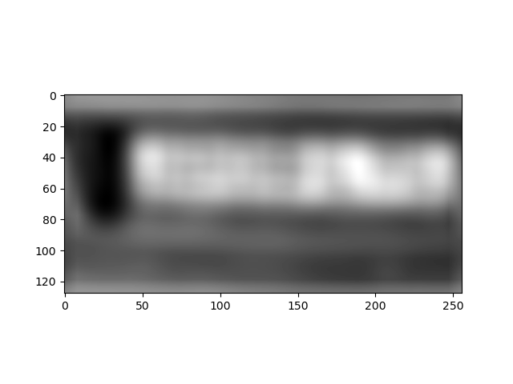
- 10-17-17
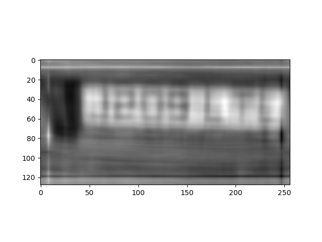
- 100-17-17
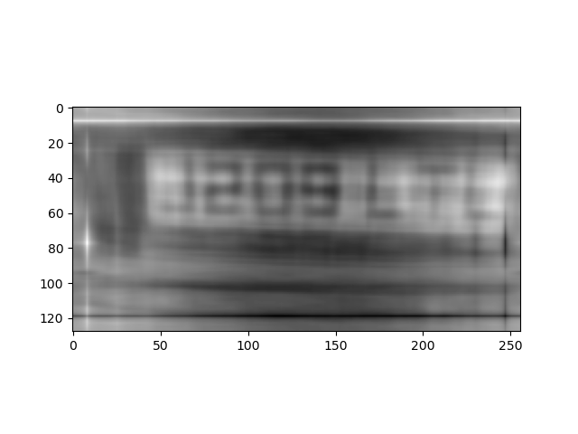
- 1000-17-17

- 10000-17-17
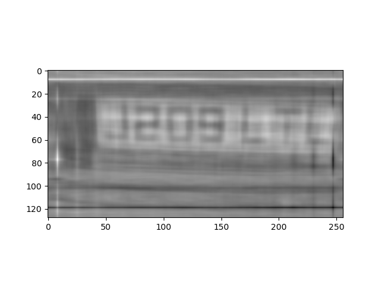
- 100000-17-17

- 1000-5-5
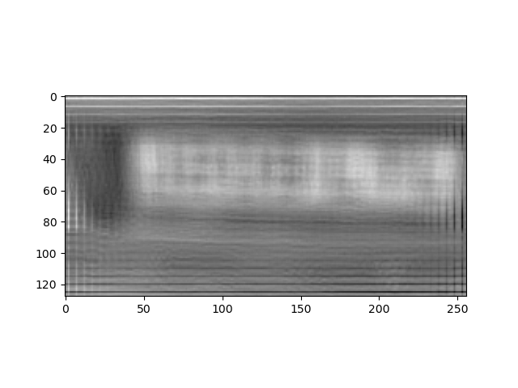
- 1000-30-30
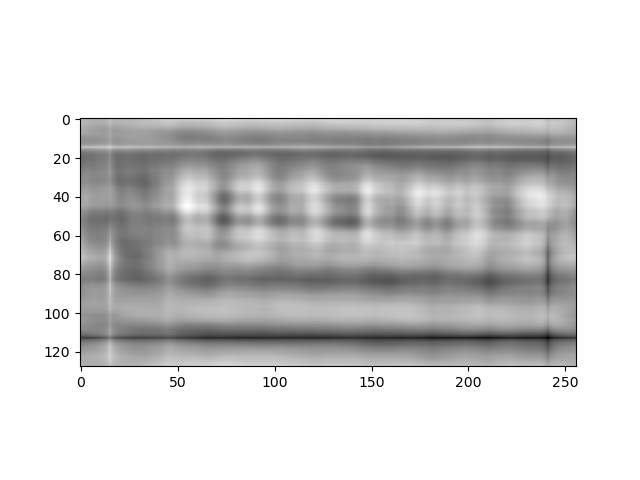

## Part 2 k-means Clustering by Semidefinite Programming (SDP) 
### 2.1
#### 2.1.a
Consider $\mathcal{X} = \{ \mathbf{X} : {\rm Tr}(\mathbf{X}) \leq \kappa, \mathbf{X} \in \mathbb{C}^{p \times p}, \mathbf{X} \succeq 0 \}$, in order to prove that $\mathcal{X}$ is a convex set, we need to prove that, given $\mathbf{X}_1, \mathbf{X}_2 \in \mathcal{X}$ and $\alpha \in [0,1]$,
$$\mathbf{X}_3 = \alpha \mathbf{X}_1 + (1 - \alpha) \mathbf{X}_2 \in \mathcal{X}$$
First we can see that $\mathbf{X}_3 \in \mathbb{C}^{p \times p}$ since $\mathbb{C}^{p \times p}$ is closed under addition. Moreover, since $\alpha, 1-\alpha \in [0, 1]$, so $\alpha\mathbf{X}_1 \succeq 0$ and $(1 - \alpha) \mathbf{X}_2 \succeq 0$ and their sum $\mathbf{X}_3 \succeq 0$, since it is the sum of two positive semi-definite matrices. Now, we need only to prove that ${\rm Tr}(\mathbf{X}_3) \leq \kappa$:
$$    {\rm Tr}(\mathbf{X}_3) = {\rm Tr}(\alpha \mathbf{X}_1 + (1 - \alpha) \mathbf{X}_2) = \alpha {\rm Tr}(\mathbf{X}_1) + (1 - \alpha) {\rm Tr}(\mathbf{X}_2))\leq \alpha\kappa+(1-\alpha)\kappa=\kappa $$
Combining three points above, we obtain $\mathbf{X}_3\in\mathcal{X}$.

#### 2.1.b
$\mathcal{X}$ needs to satisfy the following:
   $$\mathbf{X} \mathbf{1} = \mathbf{1}, \mathbf{X}^T \mathbb{1} = \mathbf{1}, \mathbf{X} \geq 0$$
we can express the constraint in the quadratic form:
- $\frac{1}{2\beta} \lVert A_1(x) - b_1 \rVert^{2}$, where $A_1(x) = \mathbf{X} \mathbf{1}$, and $b_1 = \mathbf{1}$.
- $\frac{1}{2\beta} \lVert A_2(x) - b_2 \rVert^{2}$, where $A_2(x) = \mathbf{X}^T \mathbf{1}$, and $b_2 = \mathbf{1}$.
- $\frac{1}{2\beta} {\rm dist}^2(x, \mathcal{K})$, where $\mathcal{K}$ is the positive orthant.

Hence, we can express the penalized function $f_{\beta}(x)$ as
$$    f_{\beta}(x) = f(x) + \frac{1}{2\beta} \lVert A_1(x) - b_1 \rVert^{2} + \frac{1}{2\beta} \lVert A_2(x) - b_2 \rVert^{2} + \frac{1}{2\beta} {\rm dist}^2(x, \mathcal{K}) $$
We then compute the gradient $\nabla f_{\beta}(x)$
$$    \nabla f_{\beta}(x) = \nabla f(x) + \frac{1}{\beta} (A_1^T(A_1(x) - b_1) + A_2^T(A_2(x) - b_2) + \frac{1}{2}\nabla_x {\rm dist}^2(x, \mathcal{K})) $$
In order to compute the gradient of ${\rm dist}$ function, we use the relation ${\rm dist}^2(x, \mathcal{K}) = (x - {\rm proj}_{\mathcal{K}}(x))^2$, as ${\rm proj}_{\mathcal{K}} \in \arg\min_{y \in \mathcal{Y}} \lVert y - x \rVert $ by definition of projection. Hence, thanks to the Danskin's theorem, $\frac{1}{2}\nabla_x {\rm dist}^2(x, \mathcal{K})) = x-{\rm proj}_{\mathcal{K}}(x)$. Hence,
$$    \nabla f_{\beta}(x) = \nabla f(x) + \frac{1}{\beta} (A_1^T(A_1(x) - b_1) + A_2^T(A_2(x) - b_2) + x-{\rm proj}_{\mathcal{K}}(x)) =  \nabla f(x) + v_k/\beta $$

#### 2.1.c
$$    \nabla f(x)=\nabla \langle \mathbf{C}, \mathbf{X} \rangle = \nabla {\rm Tr}(\mathbf{X}^T\mathbf{C}) = \mathbf{C} $$
Also, ${\rm proj}_{\mathcal{K}}(x)$ is element-wise operation. Define $z={\rm proj}_{\mathcal{K}}(x)$. Hence, ${\rm proj}_{\mathcal{K}}(x_{ij}) = \arg\min_{z_{ij}} \lvert x_{ij} - z_{ij} \rvert$ we have two cases: (1) $x_{ij} \geq 0$, hence ${\rm proj}_{\mathcal{X}}(x_{ij}) = x_{ij}$. (2) $x_{ij} < 0$, hence ${\rm proj}_{\mathcal{X}}(x_{ij}) = 0$. In all, ${\rm proj}_{\mathcal{X}}(x)=\max(0,x)$. 

Hence,
$$ v_k=\beta_k \mathbf{C}+A_1^T(A_1(x_k) - b_1) + A_2^T(A_2(x_k) - b_2) + \min(0,x)$$

#### 2.1.d
Use Moreau’s decomposition:
$$ y^{k+1}={\rm prox}_{\sigma g^\star}(y^k+\sigma A(\tilde{x}^{k+1}))=y^k+\sigma A(\tilde{x}^{k+1}) - \sigma {\rm prox}_{\sigma^{-1} g}(\sigma^{-1} y^k+ A(\tilde{x}^{k+1})) $$
We then compute ${\rm prox}_{\sigma^{-1} g}$. Since
$$ {\rm prox}_{\sigma^{-1} g}(\sigma^{-1} y^k_1+ A(\tilde{x}^{k+1})_1) = {\rm prox}_{\delta_{b_1}}(\sigma^{-1} y^k_1+ A(\tilde{x}^{k+1})_1) = b_1, $$
and
$$ {\rm prox}_{\sigma^{-1} g}(\sigma^{-1} y^k_2+ A(\tilde{x}^{k+1})_2) = {\rm prox}_{\delta_{b_2}}(\sigma^{-1} y^k_2+ A(\tilde{x}^{k+1})_2) = b_2, $$
and recalling $B=I$.
$$ {\rm prox}_{\sigma^{-1} g}(\sigma^{-1} y^k_3+ A(\tilde{x}^{k+1})_3) = {\rm prox}_{\delta_{\mathcal{K}}}(\sigma^{-1} y^k_3+ A(\tilde{x}^{k+1})_3) = {\rm proj}_{{\mathcal{K}}}(\sigma^{-1} y^k_3 + \tilde{x}^{k+1}), $$
In all, we have
$$ y^{k+1}_1=y^k_1+\sigma A_1 \tilde{X}^{k+1}-b_1\\
y^{k+1}_2=y^k_2+\sigma A_2 \tilde{X}^{k+1}-b_2\\
y^{k+1}_3=y^k_3+\sigma (\tilde{x}^{k+1}-{\rm proj}_{{\mathcal{K}}}(\sigma^{-1} y^k_3 + \tilde{x}^{k+1}))\\ $$
and
$$ A^\top y^{k+1} = A^\top_1 y^{k+1}_1 +A^\top_2 y^{k+1}_2+  y^{k+1}_3  = A^\top y^k+\sigma(A^\top_1(A_1 \tilde{X}^{k+1}-b_1)\\+A^\top_2(A_2 \tilde{X}^{k+1}-b_2) + \tilde{x}^{k+1}-{\rm proj}_{{\mathcal{K}}}(\sigma^{-1} y^k_3 + \tilde{x}^{k+1})) $$

#### 2.1.e
- convergence results of both algorithms
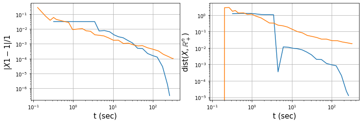
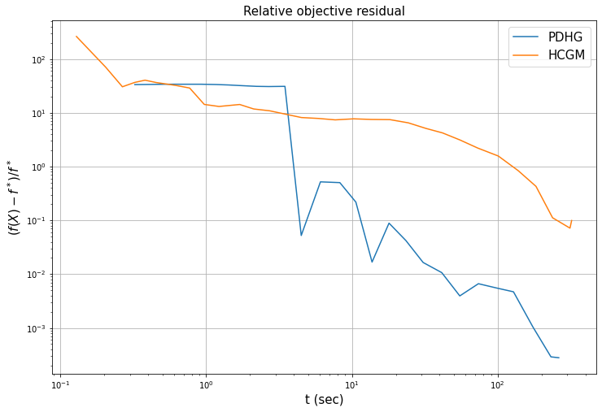

- objective value:

| PDHG              | HCGM              | Optimal     |
| ----------------- | ----------------- | ----------- |
| 57.03747459321707 | 51.38378994227327 | 57.05339187 |

We find that HCGM's result is lower than optimal, since the output of HCGM might not satisfy the equality condition $\mathbf{X1=1},\mathbf{X^\top 1=1}$.

- k-means value PDHG & HCGM

| PDHG    | HCGM    | Initial  |
| ------- | ------- | -------- |
| 28.7269 | 28.7269 | 150.9680 |

- k-means value Llyod's.

| Trial 1 | Trial 2 | Trial 3 | Trial 4  | Trial 5  |
| ------- | ------- | ------- | -------- | -------- |
| 95.9942 | 28.7347 | 28.7347 | 215.5621 | 127.7399 |

We find that Llyod's algoritho's performance (k-means value) is very unstable when changing the initialization of cluster centers, sometimes it could get near-optimal results, while sometimes it is worse than random initialization.

## Part 3 Computing a geometric embedding for the Sparsest Cut Problem via Semidefinite Programming
#### 3.a

Since $\mathbf{X}$ has $p$ singular values, the condition $\mathbf{X}\succeq 0$ has $p$ constraints. 

The first line trace equality has $1$ constraint, the second line $i\neq j\neq k\neq i$ has $p(p-1)(p-2)$ constraints, the third line $\mathbf{X}\in\mathcal{X}$ has $p+1$ constraints. In total, (7) has $p(p-1)(p-2)+p+2=O(p^3)$ constraints.

For Problem (3), $\mathbf{X1=1,X^\top 1=1}$ has $2p$ constraints, $\mathbf{X}\geq 0$ has $p^2$ constraints, $\mathbf{X}\in\mathcal{X}$ has $p+1$ constraints. In total, (3) has $p^2+3p+1=O(p^2)$ constraints.

#### 3.b
Define $\mathcal{K}_p = (-\infty, 0]^{p(p-1)(p-2)}$. Then, the constraint $\mathcal{B}(x)\in\mathcal{K}_p$ can be written as ${\rm dist}^2(\mathcal{B}(x), \mathcal{K}_p)=\min_{y\in\mathcal{K}_p} \|y-\mathcal{B}(x)\|^2$. Similar to 2.1.b, the penalized objective function is
$$
\min_{\mathbf{X}\in\mathcal{X}} f(\mathbf{X}) + g(A(\mathbf{X})) + \frac{1}{2\beta} \min_{\mathbf{Y}\in\mathcal{K}_p} \|\mathbf{Y}-\mathcal{B}(\mathbf{X})\|^2
$$

#### 3.c
G1 takes around 1.5 min, G2 takes 10 min, G3 takes 80 min. 

We find that when number of nodes $p$ increases, the computation time increases with $p^3$, which coincides with the fact that the number of constraints is $O(p^3)$, so the number of iterations `len(nchoosek_inds)` is also $O(p^3)$. When applying to large nodes, the computational time would be a major budget. 

- mammalia-primate-association-13
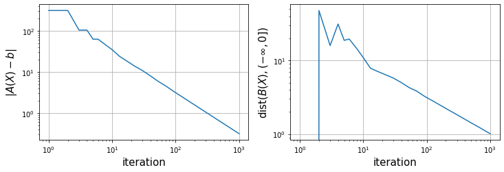
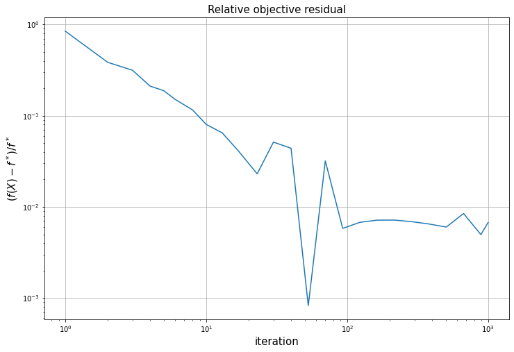

- 55n-insecta-ant-colony1-day37
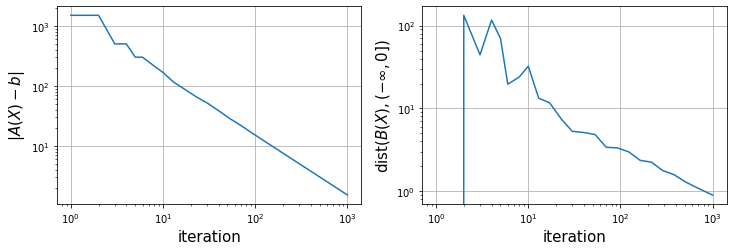
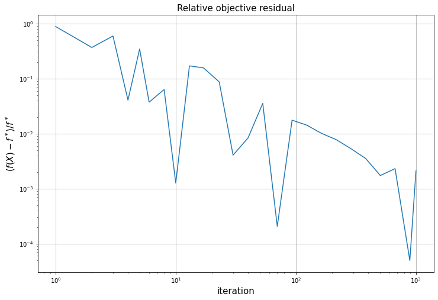

- insecta-ant-colony4-day10
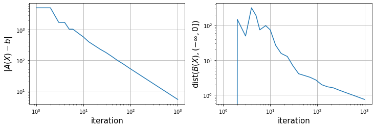
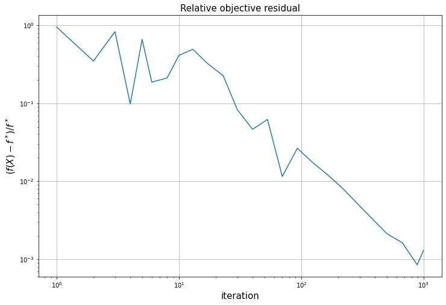